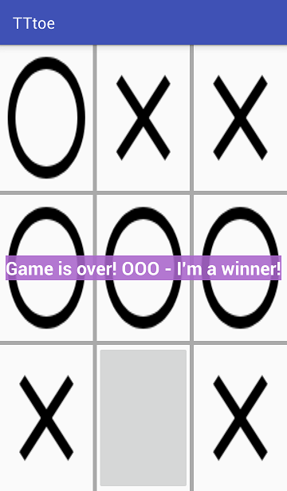

TTtoe

This application is a tic-tac-toe game. Everything is simple

Pre-requisites

	* Android SDK v26
    * Android Build Tools v27.0.1
    * Android Support Repository v47.0.0
    * Google Repository v58

Getting Started

This sample uses the Gradle build system. To build this project, use the "gradlew build" command or use "Import Project" in Android Studio.

